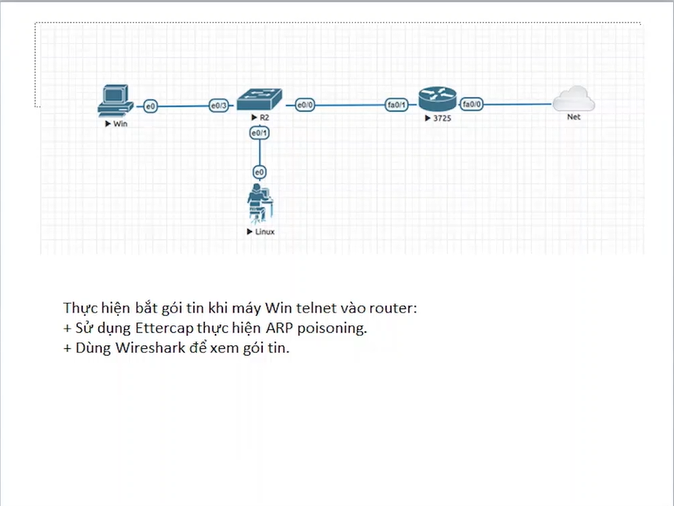
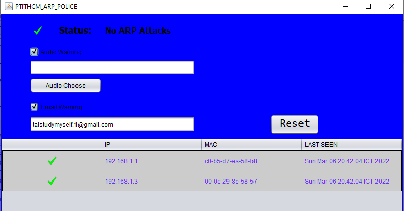
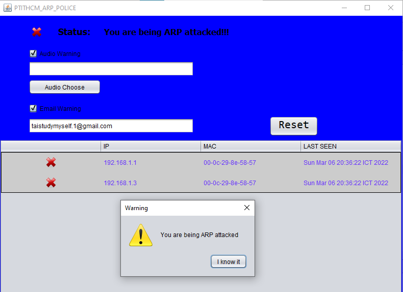
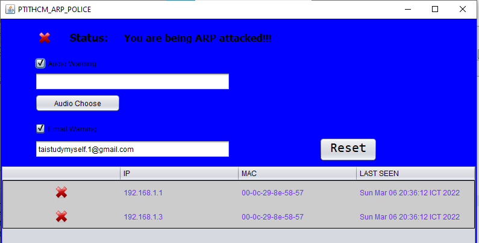
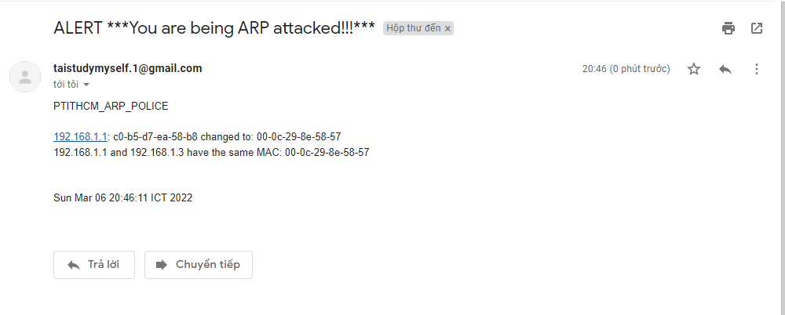
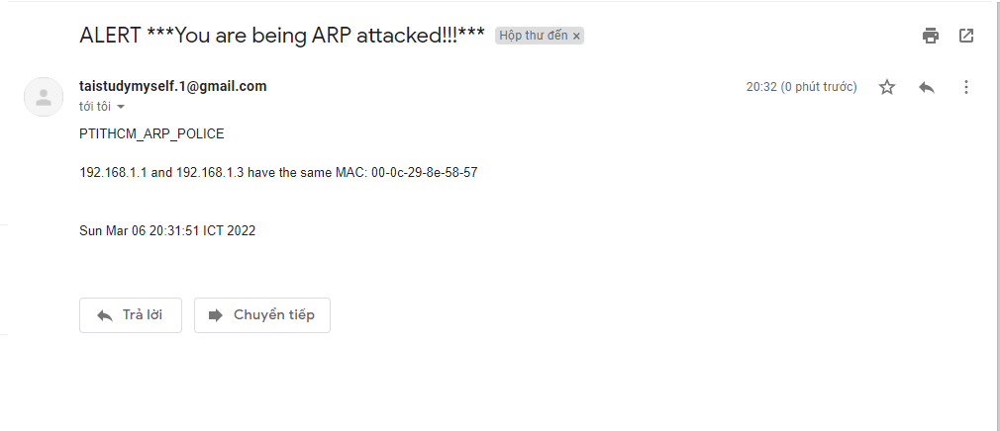

  
# ARP Cache Poisoning Detection (Java Swing)

[Network Diagram](#network-diagram) •
[Main Screen](#main-screen) •
[Attacked Screen](#attacked-screen-with-notification) •
[Alert Information Screen](#alert-information-screen-mail)

## Network Diagram

  

## Main Screen

  

## Attacked Screen With Notification

  

* **Attacked Screen**

  

## Alert Information Screen (Mail)

  

  

